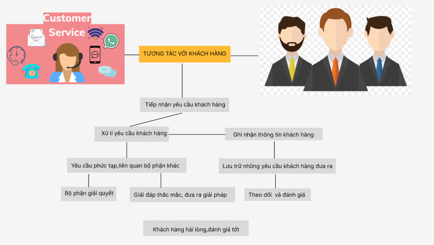

# Báo Cáo Tuần 9
## Tên nhóm: N04-KTPM (21011604@st.phenikaa-uni.edu.vn)
### Thánh viên:
    1.Nguyễn Huy Hoàng*****
    2.Dương Văn Thắng*****
    3.Nguyễn Thị Hà*****
    4.Trần Thị Hồng Ngát*****
    5.Ngô Thị Thơm *****
    6.Trần Gia Hòa*****

# Nội DUNG

# V- SƠ ĐỒ TRÌNH TỰ HỆ THỐNG
### USE CASE #1
<.jpg)
### USE CASE #2

### USE CASE #3

### ƯỚC TÍNH 
| Actor Classification                                                                                    |                                                                                                                                                                                 |              |        |
|---------------------------------------------------------------------------------------------------------|---------------------------------------------------------------------------------------------------------------------------------------------------------------------------------|--------------|--------|
| Actor Name                                                                                              | Description                                                                                                                                                                     | Complexity   | Weight |
| User/Frontend(FE)                                                                                       | Người dùng đang tương tác với giao diện người dùng đồ họa trong quá trình đăng nhập tài khoản, tạo tài khoản, nhập dữ liệu và xem kết quả của họ (dựa trên hình ảnh và văn bản) | HyperComplex | 4      |
| Blockchain                                                                                              | Hệ thống cơ sở dữ liệu tương tác với máy chủ thông qua hợp đồng thông minh                                                                                                      | Average      | 2      |
| Server                                                                                                  | Hệ thống xử lý dữ liệu tương tác với chuỗi khối thông qua hợp đồng thông minh và với giao diện người dùng/sử dụng                                                               | Average      | 2      |
| Smart Contracts                                                                                         | Hợp đồng thông minh là một giao thức máy tính bất biến nhằm tạo điều kiện kỹ thuật số, xác minh hoặc thực thi việc đàm phán hoặc thực hiện hợp đồng.                            | Average      | 2      |
| UAW(Health Engine) = 0x,           Simple + 3x Average + 1x  ,         Hyper-Complex = 3x2 + 1x4= 10 |                                                                                                                                                                                 |              |        |

| Use Case Classification                                                             |                                                                                                                                            |          |        |
|-------------------------------------------------------------------------------------|--------------------------------------------------------------------------------------------------------------------------------------------|----------|--------|
| User Case                                                                           | Description                                                                                                                                | Category | Weight |
| Quản lý thông tin khách hàng (UC-1)                                                 | Tạo và quản lí thông tin cá nhân, thông tin liên lạc, lịch sử mua hàng của khách hàng.                                                     | Complex  | 15     |
| Quản lý dữ liệu khách hàng (UC-2)                                                   | Theo dõi hoạt động của khách hàng, thống kê và phân tích dữ liệu khách hàng để cải thiện trải nghiệm khách hàng và tăng doanh số bán hàng. | Complex  | 15     |
| Tương tác với khách hàng (UC-3)                                                     | Tạo liên lạc và tương tác với khách hàng để cung cấp thông tin sản phẩm/dịch vụ mới và giải đáp các thắc mắc của khách hàng.               | Average  | 10     |
| UUCW(Health Engine) = 0x ,Simple + 1x ,Average + 2x ,Complex = 1 x 10 + 2 x 15 = 40 |                                                                                                                                            |          |        |

| Technical Complexity Factors                                                                            |                                                                                                                                                              |        |                      |                  |
|---------------------------------------------------------------------------------------------------------|--------------------------------------------------------------------------------------------------------------------------------------------------------------|--------|----------------------|------------------|
| Technical Facto                                                                                         | Description                                                                                                                                                  | Weight | Perceived Complexity | CalculatedFactor |
| T1                                                                                                      | Security: Strong security measures needed to protect customer	3	4	3x4=12                                                                                     |        |                      |                  |
| T2                                                                                                      | Scalability: The system needs to be able to handle a large number of customer records and user traffic.                                                      | 2      | 4                    | 2x4=8            |
| T3                                                                                                      | Usability: The system should be user-friendly and easy to navigate, with clear instructions and intuitive interfaces                                         | 1      | 2                    | 1x2=2            |
| T4                                                                                                      | Integration: The system should be able to integrate with other systems used by the company (e.g. CRM, ERP, billing systems).                                 | 2      | 3                    | 2x3=6            |
| T5                                                                                                      | Performance: The system should be fast and responsive, with quick data retrieval and search capabilities                                                     | 2      | 4                    | 2x4=8            |
| T6                                                                                                      | Accessibility: The system should be accessible from different devices and platforms (e.g. desktop, mobile, tablet)                                           | 1      | 3                    | 1x3=3            |
| T7                                                                                                      | Reliability: The system should be reliable, with minimal downtime and quick recovery in case of failure.                                                     | 2      | 4                    | 2x4=8            |
| T8                                                                                                      | Data backup and recovery: The system should have a robust data backup and recovery mechanism in place to prevent data loss                                   | 3      | 3                    | 3x3=9            |
| T9                                                                                                      | System maintenance: The system should be designed for easy maintenance and updates, with minimal disruption to operations                                    | 1      | 3                    | 1x3=3            |
| T10                                                                                                     | Reporting and analytics: The system should provide reporting and analytics capabilities to help the company gain insights into customer behavior and trends. | 2      | 4                    | 2x4=8            |

| Technical Factor                                                                                        | 67 |
|---------------------------------------------------------------------------------------------------------|----|
| Total                                                                                                   |    |
| TCF(Customer Info System) = Constant-1 + Constant-2 x Technical Factor Total = 0.6 + (0.01 x 67) = 1.27 |    |
    
