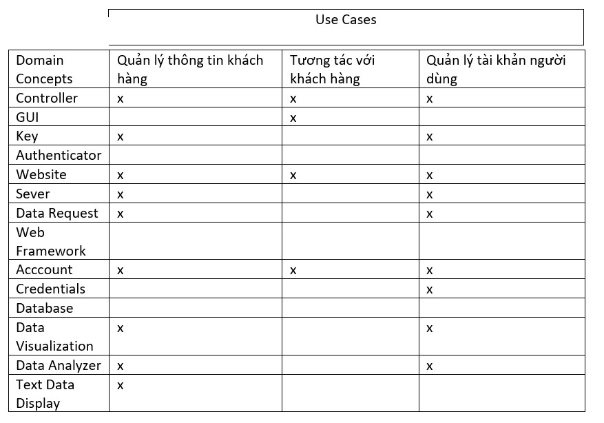

# Báo Cáo Tuần 10
## Tên nhóm: N04-KTPM (21011604@st.phenikaa-uni.edu.vn)
### Thánh viên:
    1.Nguyễn Huy Hoàng*****
    2.Dương Văn Thắng*****
    3.Nguyễn Thị Hà*****
    4.Trần Thị Hồng Ngát*****
    5.Ngô Thị Thơm *****
    6.Trần Gia Hòa*****

# Nội DUNG
## 6.a  Phân tích miền

Concept definitions

| Mô tả trách nhiệm                                                                                                                                                                                                          | Loại | Tên                        |
|----------------------------------------------------------------------------------------------------------------------------------------------------------------------------------------------------------------------------|------|----------------------------|
| Website với các trang React cho đăng nhập tài khoản, tạo tài khoản, và xem kết quả trong giao diện được làm từ hình vector có thể mở rộng.                                                                                 | K    | Giao diện người dùng (GUI) |
| Mẫu chỉ định các thông số để truy xuất dữ liệu từ blockchain, cũng như các thông số cho phân tích dữ liệu mong muốn.                                                                                                       | K    | Yêu cầu dữ liệu            |
| Mẫu nhập dữ liệu nơi người dùng nhập thông tin sức khỏe của mình.                                                                                                                                                          | K    | Dữ liệu người dùng         |
| Hiển thị dữ liệu không đồ họa và các bản tóm tắt một cách có tổ chức cho dữ liệu được yêu cầu bởi người dùng.                                                                                                              | D    | Hiển thị dữ liệu văn bảnv  |
| Tạo các biểu đồ dữ liệu cho dữ liệu được yêu cầu bởi người dùng.                                                                                                                                                           | D    | Trình tạo biểu đồ dữ liệu  |
| Thiết lập kết nối đến Ethereum Blockchain. Chấp nhận yêu cầu dữ liệu và dữ liệu người dùng, và trả về dữ liệu gốc.                                                                                                         | D    | Hợp đồng thông minh        |
| Phân tích dữ liệu gốc cho các phép đo yêu cầu.                                                                                                                                                                             | D    | Trình phân tích dữ liệu    |
| Chứa dữ liệu xác thực của người dùng (người dùng cá nhân và bên thứ ba).                                                                                                                                                   | K    | Khóa                       |
| Xác minh rằng người dùng với các thông tin xác thực phù hợp tồn tại. Nếu không, thông báo cho người dùng và tiến hành tương ứng. Lấy quyền truy cập cho đăng nhập bên thứ ba.                                              | D    | Xác thực người dùng        |
| Điều phối hành động của các khái niệm hệ thống và yêu cầu người dùng. Chịu trách nhiệm cho việc truy xuất dữ liệu và chuyển đổi đến các khái niệm. Cập nhật dữ liệu định kỳ và đăng xuất người dùng sau thời gian kéo dài. | D    | Điều khiển                 |
| Chứa thông tin tài khoản của một người dùng cụ thể và cung cấp tính linh hoạt hoàn toàn trong việc quản lý dữ liệu của người dùng.                                                                                         | K    | Tài khoản                  |
| Lưu trữ dữ liệu tài khoản,dữ liệu người dùng và hợp tác các hoạt động liên quan đến trực quan hoá dữ liệu,quản tri và lưu trữ                                                                                              | K,D  | Dữ liệu                    |

#### I: Định nghĩa khái niệm:

| Mô tả trách nhiệm                                                                                                                                                                                 | Kiểu            | Tên khái niệm              |
|---------------------------------------------------------------------------------------------------------------------------------------------------------------------------------------------------|-----------------|----------------------------|
| Mô tả trang web có giao diện người dùng (GUI) được tạo từ đồ họa vector có thể mở rộng để đăng nhập, tạo tài khoản và xem kết quả cũng như kết quả.                                               | K               | Giao diện người dùng (GUI) |
| Mẫu đặc tả các tham số để lấy dữ liệu từ blockchain, cũng như các tham số cho phân tích dữ liệu mong muốn.                                                                                        | K               | Yêu cầu dữ liệu            |
| Mẫu đầu vào dữ liệu nơi người dùng nhập thông tin sức khỏe của họ.                                                                                                                                | K               | Dữ liệu người dùng         |
| Hiển thị dữ liệu văn bản và tóm tắt theo cách đã tổ chức cho dữ liệu được yêu cầu bởi người dùng.                                                                                                 | D               | Hiển thị dữ liệu văn bản   |
| Tạo hình ảnh trực quan hóa dữ liệu cho dữ liệu được yêu cầu bởi người dùng.                                                                                                                       | D               | Trình tạo hình ảnh dữ liệu |
| Thiết lập kết nối với Ethereum Blockchain. Chấp nhận yêu cầu dữ liệu và dữ liệu người dùng, và trả về dữ liệu raw.                                                                                | D               | Hợp đồng thông minh        |
| Phân tích dữ liệu raw cho các đo lường được yêu cầu.                                                                                                                                              | D               | Phân tích dữ liệu          |
| Chứa dữ liệu xác thực của người dùng (cả người dùng cá nhân và bên thứ ba).                                                                                                                       | K               | Mã định danh (Key)         |
| Xác minh rằng một người dùng với thông tin xác thực phù hợp tồn tại. Nếu không, thông báo cho người dùng và tiếp tục thực hiện. Nhận quyền truy cập đăng nhập bên thứ ba.                         | D               | Xác thực người dùng        |
| Phối hợp hành động của các khái niệm hệ thống và yêu cầu người dùng. Trách nhiệm lấy và chuyển dữ liệu cho các khái niệm. Cập nhật dữ liệu định kỳ và đăng xuất người dùng sau thời gian kéo dài. | D	Bộ điều khiển |                            |
| Chứa thông tin tài khoản của một người dùng cụ thể và cung cấp sự linh hoạt hoàn chỉnh trong việc quản lý dữ liệu của người dùng.                                                                 | K               | Tài khoản                  |
| Lưu trữ dữ liệu tài khoản, dữ liệu người dùng và hợp tác trong tất cả các hoạt động liên quan đến trực quan hóa dữ liệu, quản trị và lưu trữ.                                                     | K, D            | Lưu trữ dữ liệu            |

#### II: Định nghĩa kết hợp:

| Cặp khái niệm                                          | Mô tả kết nối                                                                                                                                                                     | Tên kết nối                                                    |
|--------------------------------------------------------|-----------------------------------------------------------------------------------------------------------------------------------------------------------------------------------|----------------------------------------------------------------|
| Giao diện người dùng (UI) <-> Khóa                     | Người dùng nhập thông tin đăng nhập hoặc thông tin người dùng mới trên UI                                                                                                         | Thông tin đăng nhập người dùng                                 |
| Khóa <-> Xác thực                                      | Authenticator lấy thông tin người dùng và chuẩn bị yêu cầu xác minh, được gửi đến bộ điều khiển.                                                                                  | Chuẩn bị yêu cầu                                               |
| Xác thực <-> Bộ điều khiển                             | (1) Bộ điều khiển nhận yêu cầu xác minh, được sử dụng để kích hoạt hợp đồng thông minh thích hợp.  (2) Bộ điều khiển thông báo cho Authenticator về việc đăng nhập thành công. | (1) Truyền đường dẫn yêu cầu . (2) Truyền kết quả           |
| Bộ điều khiển <-> Yêu cầu dữ liệu                      | Bộ điều khiển nhận yêu cầu dữ liệu. Nó chuẩn bị một yêu cầu dữ liệu chính thức.                                                                                                   | Chuẩn bị yêu cầu                                               |
| Bộ điều khiển <-> Dữ liệu người dùng                   | Bộ điều khiển nhận dữ liệu người dùng. Nó chuẩn bị một yêu cầu tải lên dữ liệu chính thức.                                                                                        | Chuẩn bị yêu cầu                                               |
| Bộ điều khiển <-> Hợp đồng thông minh                  | (1) Bộ điều khiển tạo ra một yêu cầu để kích hoạt hợp đồng thông minh thích hợp để truy xuất dữ liệu.  (2) Bộ điều khiển nhận dữ liệu thô từ blockchain.                       | (1) Tạo yêu cầu . (2) Nhận dữ liệu                          |
| Bộ điều khiển <-> Trình phân tích dữ liệu              | Bộ điều khiển chuyển dữ liệu thô cho bộ phân tích dữ liệu.                                                                                                                        | Truyền dữ liệu                                                 |
| Trình phân tích dữ liệu <-> Trình hiển thị dữ liệu     | Bộ phân tích chuyển dữ liệu được xử lý cho phần mềm trình diễn dữ liệu.                                                                                                           | Truyền dữ liệu                                                 |
| Xác thực <-> Giao diện người dùng (UI)                 | (1) Authenticator yêu cầu quyền truy cập cho đăng nhập bên thứ ba.  (2) Authenticator yêu cầu thông tin người dùng hợp lệ.                                                     | (1) Yêu cầu quyền truy cập. (2) Yêu cầu thông tin đăng nhập |
| Trình phân tích dữ liệu <-> Hiển thị dữ liệu văn bản   | Bộ phân tích chuyển dữ liệu văn bản được xử lý để hiển thị.                                                                                                                       | Truyền dữ liệu                                                 |
| Yêu cầu dữ liệu <-> Giao diện người dùng (UI)          | Người dùng nhập thông số cho yêu cầu dữ liệu, sau đó nó được chứa trong một biểu mẫu.                                                                                             | Nhận tham số                                                   |
| Dữ liệu người dùng <-> Giao diện người dùng (UI)       | Người dùng nhập yêu cầu dữ liệu cá nhân, được đưa ra theo các tham số (ví dụ: ID người dùng).                                                                                     | Nhận tham số                                                   |
| Hiển thị dữ liệu văn bản <-> Giao diện người dùng (UI) | Hiển thị dữ liệu không đồ họa theo cách đã tổ chức.                                                                                                                               | Hiển thị dữ liệu                                               |
| Trình hiển thị dữ liệu <-> Giao diện người dùng (UI)   | Hiển thị dữ liệu đồ họa.                                                                                                                                                          | Hiển thị                                                       |
| Bộ điều khiển <-> Cơ sở dữ liệu                        | (1) Tạo yêu cầu truy xuất/dữ liệu upload. (2) Nhận dữ liệu từ cơ sở dữ liệu                                                                                                    | (1) Yêu cầu Dữ liệu. (2) Nhận Dữ liệu                       |
| Xác thực <-> Tài khoản                                 | Sau khi xác thực, dữ liệu tài khoản người dùng được lưu trữ trong khái niệm Tài khoản (từ cơ sở dữ liệu)                                                                          | Gửi thông tin Tài khoản                                        |
| Tài khoản <-> Yêu cầu dữ liệu                          | Yêu cầu dữ liệu nhận thông tin tài khoản để được chuyển tiếp cùng yêu cầu                                                                                                         | Nhận thông tin Tài khoản                                       |
| Tài khoản <-> Dữ liệu người dùng                       | Mẫu Dữ liệu Người dùng nhận thông tin tài khoản để được chuyển tiếp cùng dữ liệu người dùng                                                                                       | Nhận thông tin Tài khoản                                       |

#### III: Định nghĩa thuộc tính

| Trách nhiệm                                                                              | Thuộc tính        | Khái niệm         |  |
|------------------------------------------------------------------------------------------|-------------------|-------------------|---|
| A1: Hiển thị dữ liệu, thông tin người dùng                                               | dispUserInfo      | Giao diện         |  |
| A2: Hiển thị biểu mẫu để tương tác với người dùng                                        | dispForms         | Giao diện         |  |
| A3: Xác thực dữ liệu đầu vào trước khi gửi biểu mẫu web                                  | uiDataValidator   | Giao diện         |  |
| A4: Hiển thị báo cáo thống kê và so sánh và khuyến nghị                                  | dispReports       | Giao diện         |  |
| A5: Xác thực id người dùng và mật khẩu đã nhập của người dùng                            | valUserInfo       | Checker           |  |
| A6: Xác thực dữ liệu do người dùng nhập (xác thực ngoại lệ)                              | valUserData       | Checker           |  |
| A7: Xác thực khối mới từ tất cả người dùng                                               | valUserBlock      | Checker           |  |
| A8: Đọc dữ liệu sức khỏe, thông tin đăng nhập và thông tin cá nhân của người dùng        | readDataInterface | Trình đọc văn bản |  |
| A9: Đọc tin nhắn do người dùng gửi đến nhóm hỗ trợ / người dùng khác                     | đọcTin nhắn       | Trình đọc văn bản |  |
| R10: Đọc dữ liệu phát trực tuyến từ thiết bị (Ví dụ: Apple Watch)                        | readDataDephó     | Trình đọc văn bản |  |
| R11: Đọc các thông số điều khiển để tạo báo cáo                                          | readControlData   | Trình đọc văn bản |  |
| R12: Khối băm phát sóng và tham số mới cho tất cả người dùng                             | khối phát sóng    | Giao tiếp         |  |
| A13: Gửi tin nhắn, đề xuất, thông tin cá nhân, dữ liệu lịch sử và so sánh cho người dùng | systemToUserComm  | Giao tiếp         |  |
| A14: Gửi tin nhắn đến hệ thống để chặn xác nhận và phản hồi / yêu cầu                    | ToSystemComm      | Giao tiếp hoặc    |  |
| A15: Gửi tin nhắn to người dùng khác                                                     | ToUserComm        | Giao tiếp         |  |
| A16: Thêm khối vào cơ sở dữ liệu                                                         | addBlock          | Điều khiển        |  |
| A17: Nhận khối từ cơ sở dữ liệu                                                          | getBlock          | Điều khiển        |  |

#### IV: Ma trận truy xuất nguồn gốc(Traceability Matrix)

## 6.b:Cơ chế vận hành vận hành hệ thống (System Operation Contracts)
| Name                               | Quản lý thông tin khách hàng                                                      |
|------------------------------------|-----------------------------------------------------------------------------------|
| Responsibilities(trách nghiệm)     | Chấp nhận tài khoản người dùng.                                                   |
| Use Case                           | 1                                                                                 |
| Exception(ngoại lệ)                | Tài khoản hoặc mật khẩu sai. Định dạng dữ liệu nhập vào sai                       |
| Precondition(điều kiện kiên quyết) | Người dùng có một tài khoản. Hệ thống nhắc người dùng cả tài khoản và mật khẩu    |
| Postcondition(hậu điều kiện)       | Người dùng có thể thay đổi mật khẩu.Cho phép thêm hoặc sửa đổi dữ liệu khách hàng |

| Name                               | Phân tích dữ liệu                                                                     |
|------------------------------------|---------------------------------------------------------------------------------------|
| Responsibilities(trách nghiệm)     | Cho phép người dùng phân tích dữ liệu liên quan đến khách hàng                        |
| Use Case:                          | 2                                                                                     |
| Exception(ngoại lệ)                | None                                                                                  |
| Precondition(điều kiện kiên quyết) | Người dùng phải đăng nhập                                                             |
| Postcondition(hậu điều kiện)       | Hệ thống sẽ hiển thị bảng phân tích dữ liệu dựa tren sở thích, hành vi mua hàng .v.v. |

| Name                               | Tương Tác Với Khách Hàng                                                         |
|------------------------------------|----------------------------------------------------------------------------------|
| Responsibilities(trách nghiệm)     | Tạo ra một trải nghiệm khách hàng tốt nhất có thể                                |
| Use Case:                          | 3                                                                                |
| Exception(ngoại lệ)                | Không thể liên lạc, sai số điện thoại/email,..                                   |
| Precondition(điều kiện kiên quyết) | Ghi nhận thông tin khách hàng.Xử lý yêu cầu từ khách hàng.                       |
| Postcondition(hậu điều kiện)       | Giải đáp thắc mắc, đưa ra giải pháp và giới thiệu sản phẩm.Theo dõi và đánh giá: |

## 6.c: Mô hình toán học
Mathematical Mode (còn được gọi là mode, mode value hoặc mode số) là giá trị xuất hiện nhiều nhất trong một tập dữ liệu. Trong quản lý hệ thống thông tin khách hàng, Mathematical Mode có thể được sử dụng để đưa ra những quyết định quan trọng về chiến lược kinh doanh, marketing và phát triển sản phẩm.

Ví dụ, nếu chúng ta muốn biết sản phẩm nào được khách hàng yêu thích nhất, chúng ta có thể sử dụng Mathematical Mode để xác định sản phẩm nào được mua nhiều nhất. Từ đó, chúng ta có thể phát triển các chiến lược tiếp thị và quảng cáo tốt hơn cho sản phẩm đó, đồng thời nghiên cứu cách cải thiện sản phẩm để tăng cường sự hài lòng của khách hàng.

Ngoài ra, Mathematical Mode cũng có thể được sử dụng để phân tích dữ liệu khách hàng. Ví dụ, chúng ta có thể sử dụng mode để xác định mức độ phổ biến của các sản phẩm hoặc dịch vụ khác nhau, đồng thời tìm hiểu sở thích và nhu cầu của khách hàng để phát triển sản phẩm và dịch vụ phù hợp hơn.
Tuy nhiên, cần lưu ý rằng Mathematical Mode chỉ là một trong những công cụ phân tích dữ liệu, và không thể đưa ra quyết định cuối cùng cho các vấn đề quan trọng. Khi sử dụng Mathematical Mode, chúng ta cần phải kết hợp với các phương pháp khác để đưa ra quyết định thích hợp cho doanh nghiệp.Mathematical Mode (còn được gọi là mode, mode value hoặc mode số) là giá trị xuất hiện nhiều nhất trong một tập dữ liệu. Trong quản lý hệ thống thông tin khách hàng, Mathematical Mode có thể được sử dụng để đưa ra những quyết định quan trọng về chiến lược kinh doanh, marketing và phát triển sản phẩm.

Ví dụ, nếu chúng ta muốn biết sản phẩm nào được khách hàng yêu thích nhất, chúng ta có thể sử dụng Mathematical Mode để xác định sản phẩm nào được mua nhiều nhất. Từ đó, chúng ta có thể phát triển các chiến lược tiếp thị và quảng cáo tốt hơn cho sản phẩm đó, đồng thời nghiên cứu cách cải thiện sản phẩm để tăng cường sự hài lòng của khách hàng.
Ngoài ra, Mathematical Mode cũng có thể được sử dụng để phân tích dữ liệu khách hàng. Ví dụ, chúng ta có thể sử dụng mode để xác định mức độ phổ biến của các sản phẩm hoặc dịch vụ khác nhau, đồng thời tìm hiểu sở thích và nhu cầu của khách hàng để phát triển sản phẩm và dịch vụ phù hợp hơn.

Tuy nhiên, cần lưu ý rằng Mathematical Mode chỉ là một trong những công cụ phân tích dữ liệu, và không thể đưa ra quyết định cuối cùng cho các vấn đề quan trọng. Khi sử dụng Mathematical Mode, chúng ta cần phải kết hợp với các phương pháp khác để đưa ra quyết định thích hợp cho doanh nghiệp.
