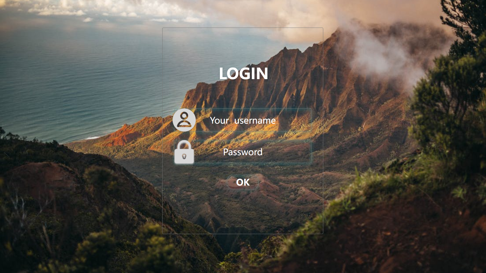
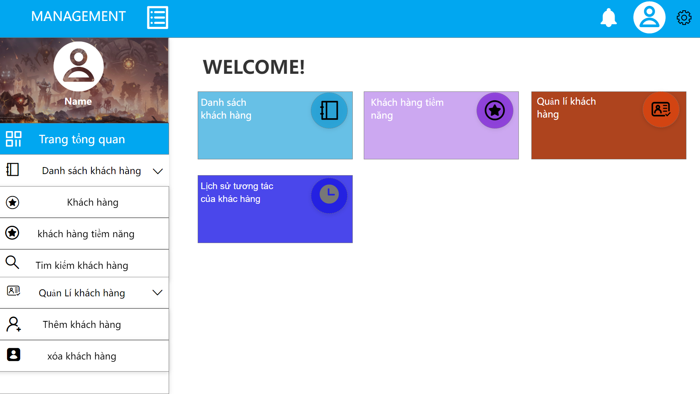
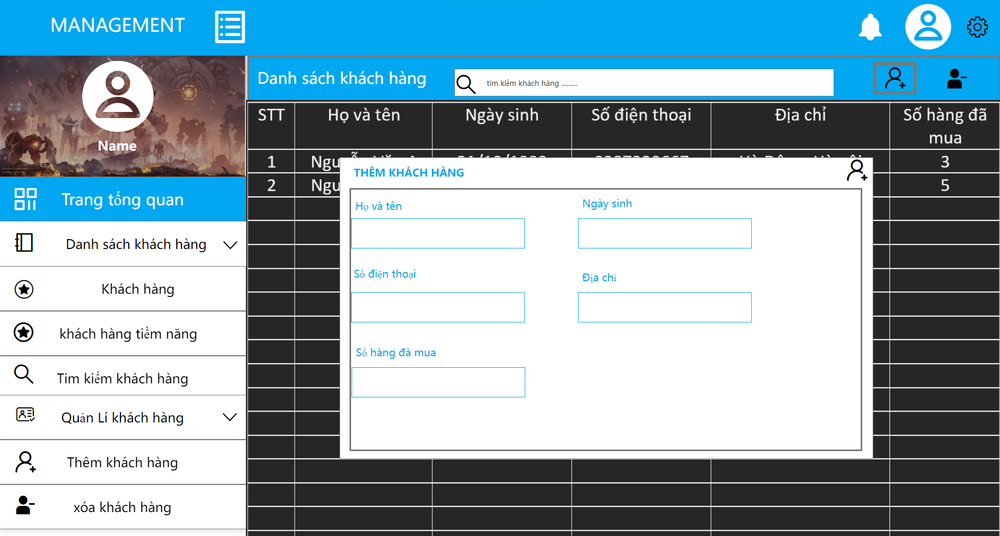

# Báo Cáo Tuần 5
## Tên nhóm: N04-KTPM (21011604@st.phenikaa-uni.edu.vn)
### Thánh viên:
    1.Nguyễn Huy Hoàng*****
    2.Dương Văn Thắng*****
    3.Nguyễn Thị Hà*****
    4.Trần Thị Hồng Ngát*****
    5.Ngô Thị Thơm *****
    6.Trần Gia Hòa*****

# I. CUSTOMER PROBLEM STATEMEN
## A. PROBLEM STATEMENT(Tuyên bố vấn đề)

Trong thời đại số hóa hiện nay, việc quản lý thông tin khách hàng trên website trở nên ngày càng quan trọng và cần thiết. Tuy nhiên, vấn đề liên quan đến bảo mật thông tin khách hàng, chất lượng dịch vụ và tính khả dụng của website đang trở thành một vấn đề cấp bách và cần được giải quyết.

Đầu tiên, vấn đề bảo mật thông tin khách hàng là một trong những thách thức lớn nhất đối với các website quản lý thông tin khách hàng. Việc lưu trữ thông tin khách hàng nhạy cảm như tên, địa chỉ, số điện thoại, email, tài khoản ngân hàng,.. yêu cầu sự bảo mật cao để tránh rủi ro bị đánh cắp thông tin và sử dụng sai mục đích. Vì vậy, các công ty cần phải đầu tư vào hệ thống bảo mật thông tin hiện đại để đảm bảo an toàn cho thông tin khách hàng.

Thứ hai, chất lượng dịch vụ là một vấn đề quan trọng khác. Các website quản lý thông tin khách hàng cần phải đảm bảo rằng thông tin của khách hàng được cập nhật đầy đủ và chính xác. Đồng thời, website cần phải cung cấp dịch vụ hỗ trợ khách hàng tốt để giải đáp các thắc mắc và giúp đỡ khách hàng khi cần thiết. Nếu chất lượng dịch vụ không đạt yêu cầu, khách hàng có thể không tin tưởng và sử dụng dịch vụ của công ty nữa.

Cuối cùng, tính khả dụng của website cũng là một vấn đề đáng quan tâm. Website quản lý thông tin khách hàng cần phải đảm bảo rằng hệ thống hoạt động ổn định và có thể đáp ứng được nhu cầu sử dụng của khách hàng. Nếu website gặp phải sự cố kỹ thuật thường xuyên hoặc quá tải, khách hàng sẽ không thể truy cập và sử dụng dịch vụ của công ty.

Vì vậy, để giải quyết các vấn đề trên, các công ty cần phải đầu tư vào hệ thống bảo mật thông tin, nâng cao chất lượng dịch vụ và đảm bảo tính khả dụng của website. Đồng thời, việc áp dụng các chuẩn mực và quy định pháp luật về bảo vệ thông tin khách hàng cũng rất quan trọng. Các công ty cần phải tuân thủ các quy định về bảo vệ dữ liệu, đảm bảo rằng thông tin khách hàng được lưu trữ và sử dụng đúng mục đích và chỉ được phép truy cập bởi những người có thẩm quyền.

Ngoài ra, việc đào tạo nhân viên để họ có kiến thức về bảo mật thông tin và quản lý thông tin khách hàng cũng rất quan trọng. Các nhân viên cần phải biết cách đối phó với các vấn đề bảo mật và giải quyết các tình huống khác nhau khi xảy ra để đảm bảo tính bảo mật và chất lượng dịch vụ cho khách hàng.

Tóm lại, việc quản lý thông tin khách hàng trên website là một vấn đề quan trọng và cần được quan tâm. Các công ty cần đầu tư vào hệ thống bảo mật thông tin, nâng cao chất lượng dịch vụ và đảm bảo tính khả dụng của website. Ngoài ra, việc tuân thủ quy định pháp luật và đào tạo nhân viên cũng rất quan trọng để đảm bảo tính bảo mật và chất lượng dịch vụ cho khách hàng.

Ngoài những vấn đề đã được đề cập ở phần trước, vấn đề về sự đa dạng và phức tạp của thông tin khách hàng cũng là một thách thức đối với các website quản lý thông tin khách hàng. Thông tin khách hàng có thể bao gồm nhiều loại thông tin khác nhau như thông tin cá nhân, thông tin sản phẩm, thông tin thanh toán, thông tin đặt hàng, v.v... Việc quản lý và xử lý đúng các loại thông tin này để phục vụ khách hàng là rất quan trọng. Do đó, các công ty cần phải có hệ thống quản lý thông tin khách hàng hiệu quả để đảm bảo sự đa dạng và phức tạp của thông tin được quản lý đúng cách.

Bên cạnh đó, vấn đề về tuân thủ quy định về bảo vệ dữ liệu cũng là một vấn đề đáng quan tâm. Các công ty cần phải tuân thủ các quy định pháp luật về bảo vệ dữ liệu khách hàng để đảm bảo tính hợp pháp và tôn trọng quyền riêng tư của khách hàng. Nếu các công ty vi phạm các quy định này, họ có thể bị phạt tiền và mất uy tín trong mắt khách hàng.

Ngoài ra, vấn đề về tính linh hoạt và tùy biến của hệ thống cũng là một yếu tố quan trọng. Các công ty cần phải có khả năng tùy biến hệ thống quản lý thông tin khách hàng để phù hợp với các yêu cầu khác nhau của từng loại khách hàng. Ví dụ, một công ty bán lẻ có nhu cầu quản lý thông tin khách hàng khác với một công ty cung cấp dịch vụ tài chính. Do đó, hệ thống quản lý thông tin khách hàng cần được thiết kế sao cho có tính linh hoạt và có thể tùy biến để phù hợp với nhu cầu của từng công ty.

Tổng kết lại, quản lý thông tin khách hàng trên website đang trở thành một vấn đề ngày càng quan trọng và cần được giải quyết. Các công ty cần đầu tư vào hệ thống bảo mật thông tin, nâng cao chất lượng dịch vụ và đảm bảo tính khả dụng của website để đáp ứng nhu cầu sử dụng của khách hàng và đảm bảo an toàn cho thông tin khách hàng. Bằng cách đảm bảo bảo mật thông tin, cung cấp chất lượng dịch vụ tốt và đảm bảo tính khả dụng của website, các công ty sẽ có được sự tin tưởng của khách hàng và có thể tăng cường mối quan hệ khách hàng-truyền thông, từ đó nâng cao hiệu quả kinh doanh. Điều quan trọng là, các công ty cần nhận thức rõ ràng về tầm quan trọng của quản lý thông tin khách hàng trên website và đưa ra các biện pháp cần thiết để giải quyết các vấn đề liên quan đến bảo mật thông tin, chất lượng dịch vụ và tính khả dụng của website.

## B. GLOSSARY OF TERMS (Thuật ngữ)
1. Khách hàng (Customer): người sử dụng sản phẩm hoặc dịch vụ của công ty.
2. Thông tin khách hàng (Customer Information): các thông tin cá nhân của khách hàng, bao gồm tên, địa chỉ, số điện thoại, địa chỉ email, giới tính, ngày sinh 
3. Hồ sơ khách hàng (Customer Profile): bản ghi về thông tin của khách hàng và các hoạt động của họ . 
4. Danh sách khách hàng (Customer List): danh sách các khách hàng đã đăng ký hoặc mua sản phẩm/dịch vụ .
5. Chăm sóc khách hàng (Customer Care): quá trình chăm sóc khách hàng để tạo lòng trung thành và duy trì mối quan hệ lâu dài. 
6. Quản lí khách hàng (Customer Management): quá trình quản lí thông tin khách hàng, bao gồm cập nhật xóa, thêm mới thông tin khách hàng vào hệ thống.
7. Liên hệ khách hàng (Customer Contact): các hoạt động tương tác với khách hàng bao gồm email, điện thoại, chat trực tuyến,...
8. Phân tích khách hàng (Customer Analytics): quá trình phân tích dữ liệu về khách hàng để tìm hiểu hành vi, sở thích và nhu cầu của họ.
9. Chương trình khách hàng thân thiết (Customer Loyalty Program): chương trình khuyến mãi, ưu đãi thưởng để giữ chân khách hàng tăng lòng trung thành của khách hàng.
10. Hệ thống quản lí khách hàng (Customer Relationship Management System - CRM): hệ thống quản lí thông tin khách hàng giúp tổ chức, quản lí chăm sóc khách hàng hiệu quả hơ

# II. SYSTEM REQUIREMENTS (YÊU CẦU HỆ THỐNG)
## A. ENUMERATED NON-FUNCTIONAL REQUIREMENTS(YÊU CẦU PHI CHỨC NĂNG ĐƯỢC ĐÁNH GIÁ)
### Yêu cầu người dùng
1. Dễ sử dụng: Người dùng mong muốn hệ thống có giao diện thân thiện, dễ sử dụng và có thể truy cập dễ dàng từ nhiều thiết bị khác nhau.

2. Bảo mật thông tin: Người dùng mong muốn hệ thống đảm bảo bảo mật thông tin khách hàng của họ, đặc biệt là các thông tin nhạy cảm như số tài khoản ngân hàng hoặc mật khẩu.

3. Tính năng tùy chỉnh: Người dùng mong muốn hệ thống có tính năng tùy chỉnh để phù hợp với nhu cầu quản lý thông tin khách hàng của họ.

4. Tính linh hoạt: Người dùng mong muốn hệ thống có tính linh hoạt để có thể thêm, sửa hoặc xóa thông tin khách hàng dễ dàng.

5. Tính năng tìm kiếm và lọc thông tin: Người dùng mong muốn hệ thống có tính năng tìm kiếm và lọc thông tin khách hàng để có thể tìm kiếm và truy cập thông tin nhanh chóng.

6. Tính năng xuất dữ liệu: Người dùng mong muốn hệ thống có tính năng xuất dữ liệu để có thể sử dụng cho mục đích khác như phân tích, báo cáo hoặc quản lý.

7. Tính năng gửi thông báo: Người dùng mong muốn hệ thống có tính năng gửi thông báo cho khách hàng một cách dễ dàng và thuận tiện.

8. Hỗ trợ khách hàng: Người dùng mong muốn hệ thống có tính năng hỗ trợ khách hàng để giúp họ giải quyết các vấn đề liên quan đến việc quản lý thông tin khách hàng.

9. Tính năng phân quyền truy cập: Người dùng mong muốn hệ thống có tính năng phân quyền truy cập để đảm bảo tính bảo mật và ngăn chặn truy cập trái phép vào thông tin khách hàng.

10. Tính năng báo cáo và thống kê: Người dùng mong muốn hệ thống có tính năng báo cáo và thống kê để có thể theo dõi tình hình quản lý thông tin khách hàng của mình.

### Yêu câu hệ thống
1. Cơ sở dữ liệu: Hệ thống phải có cơ sở dữ liệu chứa thông tin khách hàng, bao gồm tên, địa chỉ, số điện thoại, email, thông tin hóa đơn, lịch sử mua hàng, và các thông tin khác liên quan đến khách hàng.

2. Giao diện người dùng: Hệ thống phải có giao diện người dùng thân thiện và dễ sử dụng cho nhân viên quản lý thông tin khách hàng.

3. Tính năng tìm kiếm: Hệ thống phải có tính năng tìm kiếm để tìm kiếm thông tin khách hàng một cách nhanh chóng và hiệu quả.

4. Tính năng xuất dữ liệu: Hệ thống phải có tính năng xuất dữ liệu để lưu trữ và chia sẻ thông tin khách hàng trong công ty.

5. Tính năng phân tích dữ liệu: Hệ thống phải có tính năng phân tích dữ liệu để đưa ra thông tin cần thiết cho việc quản lý thông tin khách hàng và đưa ra quyết định liên quan đến khách hàng.

6. Tính năng quản lý định danh khách hàng: Hệ thống phải có khả năng quản lý định danh khách hàng để tránh trùng lặp thông tin hoặc dữ liệu khách hàng.

8. Tính năng quản lý truy cập: Hệ thống phải có tính năng quản lý truy cập để ngăn chặn truy cập trái phép và đảm bảo an toàn thông tin khách hàng.

9. Tính năng tích hợp: Hệ thống phải có khả năng tích hợp với các hệ thống khác trong công ty, như hệ thống quản lý hóa đơn, hệ thống quản lý kho, hệ thống quản lý bán hàng và hệ thống quản lý dịch vụ khách hàng.

### Yêu cầu phi chức năng: 
1. Tính bảo mật: Hệ thống phải đảm bảo an toàn thông tin khách hàng, ngăn chặn các truy cập trái phép và bảo vệ thông tin quan trọng.

2. Hiệu suất: Hệ thống phải hoạt động một cách nhanh chóng và hiệu quả để đáp ứng nhu cầu của khách hàng và giúp nhân viên quản lý thông tin một cách dễ dàng.

3. Khả năng mở rộng: Hệ thống phải có khả năng mở rộng để có thể chứa được thông tin của nhiều khách hàng và hỗ trợ tối đa cho việc quản lý thông tin của các doanh nghiệp lớn.

4. Tính linh hoạt: Hệ thống phải có khả năng thích nghi với nhiều loại dữ liệu khác nhau và có thể được tùy chỉnh để phù hợp với các nhu cầu cụ thể của khách hàng và doanh nghiệp.

5. Tính sẵn sàng: Hệ thống phải luôn sẵn sàng để sử dụng và có khả năng tự động khắc phục sự cố nhanh chóng để tránh gián đoạn hoạt động và mất dữ liệu.

6. Hỗ trợ đa nền tảng: Hệ thống phải có khả năng hỗ trợ cho nhiều nền tảng khác nhau để có thể sử dụng trên nhiều thiết bị khác nhau.

7. Dễ sử dụng: Hệ thống phải được thiết kế để sử dụng đơn giản và dễ hiểu để giúp nhân viên quản lý thông tin khách hàng một cách nhanh chóng và dễ dàng hơn

### YÊU CẦU CHỨC NĂNG ĐÁNH GIÁ

| Identifier	Priority | Weight | Requirements                                                                                                                                                                                                 |
|---------------------|--------|--------------------------------------------------------------------------------------------------------------------------------------------------------------------------------------------------------------|
| REQ-1               | 10     | Hệ thống CRM cần có khả năng bảo mật thông tin khách hàng và tránh việc thông tin bị rò rỉ hoặc mất mát.                                                                                                     |
| REQ-2               | 8      | Hệ thống CRM cần có khả năng tích hợp dữ liệu từ nhiều nguồn khác nhau như email, điện thoại, mạng xã hội, trang web.                                                                                        |
| REQ-3               | 10     | Hệ thống CRM cần có khả năng quản lý thông tin khách hàng như tên, địa chỉ, số điện thoại, email, thông tin sản phẩm mà khách hàng quan tâm, lịch sử mua hàng, các hoạt động quảng cáo, phản hồi khách hàng. |
| REQ-4               | 9      | Hệ thống CRM cần cung cấp tính năng quản lý tác vụ cho các nhân viên, bao gồm lịch hẹn, lịch gọi điện thoại, lịch gửi email.                                                                                 |
| REQ-5               | 7      | Hệ thống CRM cần có khả năng tương tác với khách hàng thông qua email, tin nhắn, điện thoại, trò chuyện trực tiếp.                                                                                           |
| REQ-6               | 5      | Hệ thống cần đơn giản, dễ sử dụng để nhân viên có thể nhanh chóng hiểu và sử dụng được.                                                                                                                      |
| REQ-7               | 6      | Hệ thống cần cung cấp tính năng phân tích dữ liệu để đưa ra các đề xuất và kế hoạch cho hoạt động kinh doanh, như tăng doanh số, tối ưu hóa chiến dịch quảng cáo.                                            |
| REQ-8               | 7      | Hệ thống CRM cần cung cấp tính năng báo cáo để giám sát và đánh giá hoạt động của công ty, từ đó đưa ra những kế hoạch phát triển kinh doanh hiệu quả.                                                       |
| REQ-9               | 9      | Hệ thống CRM cần có khả năng tích hợp với các hệ thống khác như hệ thống quản lý bán hàng, hệ thống quản lý sản phẩm, v.v. để đưa ra quyết định kinh doanh đúng đắn.                                         |
| REQ-10              | 10     | Hệ thống cần đảm bảo độ tin cậy, bao gồm khả năng hoạt động liên tục và đảm bảo tính sẵn sàng của hệ thống.                                                                                                  |
| REQ-11              | 9      | Hệ thống cần đảm bảo độ tin cậy, bao gồm khả năng hoạt động liên tục và đảm bảo tính sẵn sàng của hệ thống.                                                                                                  |
| REQ-12              | 8      | Hệ thống cần có khả năng khôi phục dữ liệu trong trường hợp xảy ra sự cố hoặc thiết bị hỏng hóc.                                                                                                             |
| REQ-13              | 6      | Hệ thống cần được thiết kế để dễ dàng bảo trì và nâng cấp, bao gồm các tính năng tự động hóa, tài liệu hướng dẫn và các công cụ hỗ trợ.                                                                      |
| REQ-14              | 10     | Hệ thống cần có các biện pháp bảo mật phù hợp để đảm bảo an toàn thông tin khách hàng và dữ liệu của doanh nghiệp.                                                                                           |
| REQ-15              | 7      | Hệ thống cần đáp ứng các yêu cầu về hiệu suất, bao gồm tốc độ xử lý, thời gian phản hồi, khả năng xử lý số lượng dữ liệu lớn và độ tin cậy.                                                                  |
| REQ-16              | 8      | Hệ thống quản lý dự án thông tin khách hàng cần được thiết kế để có thể mở rộng dễ dàng, bao gồm thêm tính năng, người dùng, và khả năng xử lý dữ liệu.                                                      |
| REQ-17              | 7      | Hệ thống cần đáp ứng các yêu cầu về tương thích với các hệ thống khác, đặc biệt là các hệ thống khác trong doanh nghiệp.                                                                                     |
## B. USER INTERFACE REQUIREMENTS(YÊU CẦU GIAO DIỆN NGƯỜI DÙNG)
| Identifier Priority | Weight | Requirements                                                                                                                                                       |
|---------------------|--------|--------------------------------------------------------------------------------------------------------------------------------------------------------------------|
| REQ-29              | 10     | GUI phải có trang đính(đăng nhập). |
| REQ-30a,b           | 10     | must phải có trang chính chứa các tính năng. GUI phải có một trang xem dữ liệu. |
| REQ-31              | 10     | GUI phải có một trang để nhập dữ liệu khách hàng.                                                                  |
                                                                                                             

